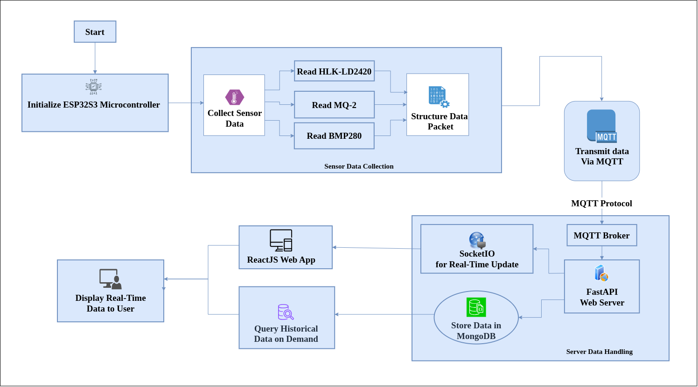

# Room Activity Scanner - IoT-Based Health & Wellness Monitoring System

An embedded system for monitoring room activity with potential automation capabilities. This project is aimed at developing a **low-cost, power-efficient IoT solution** for **health and wellness monitoring** using an ESP32-S3 microcontroller and a collection of sensors to capture room activity, environmental data, and sound levels. The system communicates using **MQTT** and can control external devices via **relay output**.

---

## 🧠 Project Goals

- Detect **human presence** and **motion** reliably using radar and motion sensors.
- Monitor **air quality**, **temperature**, **humidity**, **pressure**, and **sound levels**.
- Enable **real-time data transmission** to an MQTT broker.
- Implement **relay control** for basic room automation (e.g., fans, lights).
- Operate efficiently with a focus on **low-power consumption** and modular firmware.

---

## 📦 System Architecture

### System Overview Flowchart



### 🧩 Core Components

| Component         | Description                                                   |
|------------------|---------------------------------------------------------------|
| **YD-ESP32-S3**   | Main microcontroller; handles sensor reading & MQTT comms.   |
| **MQTT Broker**   | Used for real-time data publishing and relay command control.|

### 📡 Sensors & Modules

| Sensor/Module     | Purpose                                | Interface     |
|------------------|----------------------------------------|---------------|
| **HLK-LD2420**   | mmWave radar sensor for presence       | UART          |
| **RCWL-0516**     | Doppler radar for motion detection     | GPIO          |
| **BMP280**        | Environmental sensor (temp/press)      | I2C           |
| **MQ-2**          | Gas sensor for air quality             | Analog        |
| **INMP441**       | MEMS microphone for sound monitoring   | I2S           |
| **Relay Module**  | Controls electrical appliances         | GPIO (digital)|

---

## 📐 Firmware Details

### Development Environment

- **ESP-IDF** (on Ubuntu Linux)
- Language: **C**
- Flashing Tool: `idf.py flash`

### Sensor Data Flow

```
[Sensor Node] ---> [ESP32-S3] ---> [MQTT Publish] ---> [Broker (e.g., Mosquitto)] ---> [Dashboard/Automation System]
```

### Data Format Example (MQTT JSON Payload)

```json
{
"presence": true,
"motion": true,
"temperature": 24.3,
"pressure": 1012.8,
"air_quality": 350,
"sound_level": 47,
"timestamp": "2025-04-10T13:45:00Z"
}
```

---

## 🧪 Current Development Status

| Feature                   | Status       |
|--------------------------|--------------|
| ADC Reading (MQ-2)       | ✅ Completed |
| MQTT Publishing          | 🛠 In Progress |
| BMP280 Integration       | 🔲 Not Started |
| HLK-LD2420 (UART)        | 🛠 In Progress |
| INMP441 (I2S)            | 🔲 Not Started |
| Relay GPIO Control       | ✅ Completed |
| Calibration Logic        | 🛠 In Progress |
| OTA / Remote Config      | 🔲 Planned |

---

## 🛠 Setup & Usage

### 1. Prerequisites

- ESP-IDF set up on Ubuntu
- Working MQTT broker (e.g., local Mosquitto or public broker)
- Serial USB connection to ESP32-S3

### 2. Clone and Configure

```bash
git clone git@github.com:SiliconWit/room-activity-scan.git
cd room-activity-scan
idf.py set-target esp32s3
idf.py menuconfig  # Set Wi-Fi & MQTT credentials
```

### 3. Build and Flash

```bash
idf.py build
idf.py -p /dev/ttyUSB0 flash
```

### 4. Monitor

```bash
idf.py -p /dev/ttyUSB0 monitor
```

---

## ⚙️ Configuration Options (via `menuconfig`)

| Option                      | Description                        |
|----------------------------|------------------------------------|
| `CONFIG_WIFI_SSID`         | Your Wi-Fi SSID                    |
| `CONFIG_WIFI_PASSWORD`     | Your Wi-Fi password                |
| `CONFIG_MQTT_BROKER_URI`   | MQTT broker URI                    |
| `CONFIG_RELAY_GPIO`        | GPIO pin used for relay control    |

---

## 📊 Future Enhancements

- Web dashboard for data visualization (React + FastAPI + MongoDB)
- BLE mode for offline data retrieval
- OTA firmware updates
- Machine learning on presence/sound for anomaly detection
- Mobile app for room status alerts

---

## 📚 References

- HLK-LD2420 Datasheet
- ESP-IDF Documentation
- BMP280 Datasheet
- MQ-2 Sensor Calibration Guide
- MQTT Specification
- INMP441 I2S Microphone App Notes

---

## 👨‍💻 Author

**Lawrence Langat**  
Electronics and Firmware Developer  
[@lawrenceegr](https://github.com/lawrenceegr)

---

## 📄 License

MIT License – use freely with attribution.
